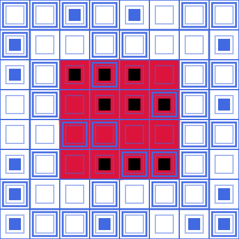

# HTML-Canvas Sketch / 221022

[Xan](https://beacons.ai/bedirxanugur) The first-canvas repository I created in the Front-End & Creative Coding




## Installation

Firstly [clone](https://github.com/bedirxanugur) the project. 

```bash
git clone https://github.com/bedirxanugur/HTML-Canvas.git
```

## Usage

After you clone the project, open it in Visual Studio Code.
***
for Linux:
```linux
cd HTML-Canvas
code .
```

## Contributing
Pull requests are accepted. For major changes, please open a thread to discuss what you want to change first.


## License
[MIT](https://choosealicense.com/licenses/mit/)
